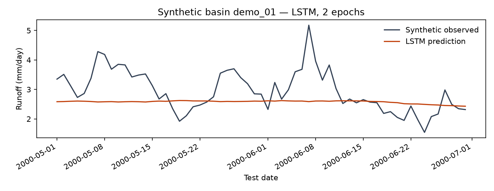

# Quick start

Create a small daily dataset, train an LSTM on CPU, and inspect its runoff
predictions. This example uses **three synthetic basins** and two training
epochs. It checks the workflow with a small model.

Complete [installation](installation.md) first. Run the commands from the
full source checkout with the ReignFlow environment active. The public preview
currently provides documentation; the package and example script accompany
the future code release.

## 1. Create the demonstration data

<!-- example: demo-data -->
```bash
python examples/quickstart/create_demo_data.py --output output/demo/CAMELS.nc
```

The file contains daily meteorological inputs, two basin attributes, and
artificial runoff from December 1999 through August 2000. No CAMELS download
is needed. *Forcing* means time-varying inputs such as rainfall and temperature;
*attributes* describe a basin, such as its area and elevation.

## 2. Train the LSTM

Copy this complete command. It trains on January–March, uses April to choose
the saved weights, and evaluates those weights on May–June.

<!-- example: quickstart-train -->
```bash
python -m reignflow \
  --task_name regression --model LSTM --data CAMELS \
  --input_nc_file output/demo/CAMELS.nc --all_stations \
  --time_series_variables daymet_prcp,daymet_tmean,daymet_pet \
  --static_variables area_gages2,elev_mean \
  --train_date_list 2000-01-01,2000-03-31 \
  --val_date_list 2000-04-01,2000-04-30 \
  --test_date_list 2000-05-01,2000-06-30 \
  --seq_len 14 --pred_len 1 --d_model 16 --dropout 0 \
  --batch_size 32 --epochs 2 --learning_rate 0.001 \
  --do_eval --device cpu --seed 42 \
  --save_best --output_dir output/demo/lstm --des quickstart
```

`seq_len=14` supplies 14 input days; `pred_len=1` estimates runoff on the last
of those days. `--save_best` chooses the weights with the highest validation
NSE. Keep the other settings for this first run; the
[experiment guide](../guides/training.md) explains how to adapt them.

## 3. Inspect the predictions

Follow the output directory printed by the command, under `output/demo/lstm/`.
Open **`results/feature_Runoff.png`** to compare predicted and observed runoff.
The program also prints test NSE, KGE, correlation, and RMSE.

| Check | Expected for this example |
|---|---|
| Saved predictions and observations | `results/pred.npy` and `results/true.npy` |
| Array shape | `[3, 61, 1]`: three basins, 61 test days, one target |
| Time interval and units | 1 May–30 June 2000; runoff in mm/day |
| Successful workflow | Training and testing finish, with finite predictions and metrics |



This is an actual CPU run of the commands above. The optional script below
adds dates and units to the same saved arrays. Two epochs can leave peaks
poorly captured; the example does not establish hydrological prediction skill.
The [validation record](../reference/validation.md) identifies the source
snapshot and environment. Your scores can differ across environments.

| Metric | How to read it |
|---|---|
| NSE | 1 is a perfect match; 0 has the same squared error as predicting the observed mean over the evaluated samples; negative values are worse than that reference |
| RMSE | Typical error magnitude in the target units; 0 is a perfect match. Here the unit is mm/day |

Scores summarize all three basins by their median; the figure shows only the
first basin. A short synthetic run may have low NSE even when installation
and data alignment are correct. For real experiments, inspect the curves
and [diagnose poor results](../reference/troubleshooting.md#the-run-finishes-but-results-look-wrong)
before comparing model scores.

<details markdown="1">
<summary>Optional: recompute the scores and draw the annotated figure</summary>

This selects the most recent quick-start run in `output/demo/lstm/`.

<!-- example: quickstart-metrics -->
```bash
python - <<'PY'
from pathlib import Path
import numpy as np
import pandas as pd
import matplotlib.pyplot as plt
from reignflow.utils.stats.metrics import cal_stations_metrics

run = max(Path("output/demo/lstm").glob("regression_LSTM_*"), key=lambda p: p.name)
pred = np.load(run / "results/pred.npy", allow_pickle=False)
true = np.load(run / "results/true.npy", allow_pickle=False)
print("Prediction shape:", pred.shape)
metrics = cal_stations_metrics(true[:, :, 0], pred[:, :, 0], ["NSE", "RMSE"])
print({name: float(np.nanmedian(values)) for name, values in metrics.items()})

dates = pd.date_range("2000-05-01", periods=pred.shape[1], freq="D")
fig, ax = plt.subplots(figsize=(9, 3.5))
ax.plot(dates, true[0, :, 0], label="Synthetic observed", color="#334155")
ax.plot(dates, pred[0, :, 0], label="LSTM prediction", color="#c2410c")
ax.set(xlabel="Test date", ylabel="Runoff (mm/day)",
       title="Synthetic basin demo_01 — LSTM, 2 epochs")
ax.legend(frameon=False)
fig.autofmt_xdate()
fig.tight_layout()
figure = run / "results/quickstart_runoff.png"
fig.savefig(figure, dpi=160)
plt.close(fig)
print("Saved figure:", figure)
PY
```

</details>

Next, [use real CAMELS data](../tutorials/first-lstm.md),
[prepare your own data](../data/custom-data.md), or
[reload and export this model](../guides/evaluate-and-share.md#replay-the-quick-start-run).
